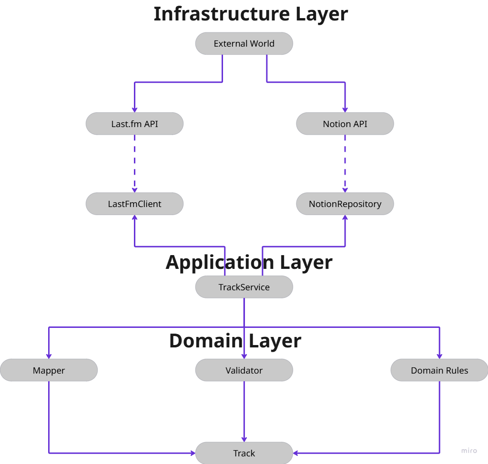

# AI Music Intelligence Pipeline

Проект автоматической синхронизации музыкальной истории прослушивания из Last.fm в Notion.

## Architecture
The project follows Vladimir Khorikov's principles of testable architecture.

- Domain logic is isolated from infrastructure.
- External dependencies are accessed through contracts.
- Application Service coordinates use cases.
- Unit tests validate domain rules.
- Module tests validate application behavior.

<p align="center">
  
</p>

## Тестирование

### Unit Tests

- Mapper
- Validator

### Module Tests

- TrackService

## Технологии

- Python
- Pytest
- Notion
- n8n
- Zephyr Scale

## Запуск тестов

```bash
pytest
```
